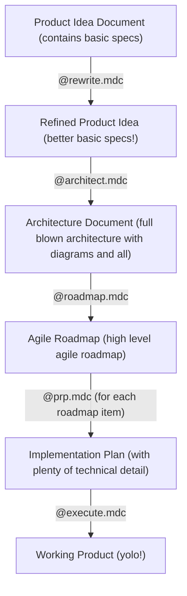
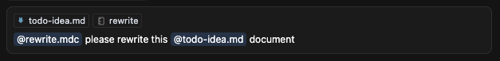
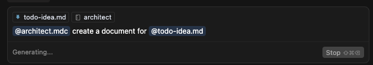
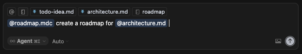
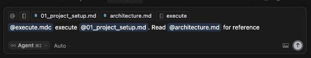

# Context Engineering Rules for Cursor

A collection of Cursor rules that help you automate your software development process with AI, using [Context
Engineering](https://github.com/coleam00/context-engineering-intro). It's like vibe coding but, because you're putting
an effort into planning, with much better results.

These rules are inspired by some of the interesting things people are learning about prompt engineering. Most of the
very clever people online are using [Claude Code](https://https://claude.ai/), which I would love to try out, but I'm
using up my Cursor subscription first before switching. 😊

## Prerequisites

- [Cursor](https://www.cursor.com/)
- [Context7 MCP Server](https://github.com/upstash/context7) - optional but extremely useful
- [Playwright MCP Server](https://github.com/microsoft/playwright-mcp) - optional but also useful
- a POSIX called `sh` on your PATH (if you want to run the install script)

## Installation

This installs the custom rules in your current directory's `.cursor/rules` directory. It won't do anything if that
directory already exists.

```sh
curl -sSL https://raw.githubusercontent.com/gertalot/cursor-rules/main/init.sh | sh
```

### Manual installation

If you can't or don't want to run the script, just copy the files from the "rules" directory to your `.cursor/rules`.

## Project Structure

To get started, run the install script as shown above. This creates the following structure in your current directory:

```txt
my_project
  +- .cursor
  |    +- rules
  |         +- (the rules from this repo)
  |
  +- docs
      +- project
      |   +- PROJECT.md (project-wide design and architecture context for the LLM)
      |   +- ROADMAP.md (project roadmap)
      |   +- TASKS.md (track completed tasks)
      |  
      +- prps (Product Requirement Prompts; like PRDs but for LLMs)
          +- (directories and files with PRPs)
```

- **.cursor/rules/**:  All the custom Cursor rule files from this repository.
- **docs/project/**: Contains project-level documentation (idea, architecture, roadmap, etc.).
- **docs/prps/**: Contains detailed product requirement prompts (stories) for each roadmap item.

## Rules

## Language-specific

These are automatically loaded when the agent is working with code files. They define preferred tech stack, versions,
testing, and code style

- **python-fastapi**
- **rust-leptos**
- **typescript-nextjs**

## Manual, general purpose

| **rule** | **example** | **description** |
| -------- | ----------- | --------------- |
| **rewrite** | `@rewrite.mdc rewrite the @README.md document` | rewrite text for clarity, structure, and brevity |
| **condense** | `@condense.mdc this chat` | capture and condense the chat into a markdown document |

## Coding workflow rules

The **context** rule is always loaded. It tells the agent where to look for documentation and examples, and general
guidelines around the agent's behaviour. It instructs the LLM to look at the docs/project/ARCHITECTURE.md and other
relevant documents. It instructs the LLM to think step by step, use the context7 MCP server, follow best practice, etc.

| **rule** | **example** | **description** |
| -------- | ----------- | --------------- |
| **architect** | `@architect.mdc let's architect the @initial_prompt.md document` | turn an idea into a detailed architecture document |
| **roadmap** | `@roadmap.mdc create a roadmap for @ARCHITECTURE.md` | Produce a number of roadmap steps to implement the architecture |
| **prp** | `@prp.mdc create requirements for roadmap item 1 from @ROADMAP.md` | create a detailed technical implementation plan in the form of a Product Requirements Prompt for a roadmap item |
| **execute** | `@execute.mdc execute the plan in @prps/myfeature/PRP.md` | implement (vibe-code) the PRP |
| **yolo** | `@yolo.mdc @execute.mdc execute the plan in @prps/myfeature/PRP.md` | like execute, but instruct Cursor to execute all necessary commands without waiting for the user |

## Workflow Overview

The following diagram illustrates the overall workflow:



The workflow consists of five main steps, each supported by a specific rule. Here's how to use them. Use each of these
rules in a new chat and reference relevant documents.

### 1. Capture and Refine Your Idea (`rewrite` rule)



- **Create an initial idea document**: In `docs/project/PROMPT.md`, write a markdown file describing your product idea.
  Include any relevant references, such as screenshots, UI designs, or other documents. See [this starting
  point](example-starting-point.md) for an example.
- **Use the `rewrite` rule**: Apply the `@rewrite.mdc` rule to your idea document. This rule helps you restructure and
  clarify your idea, making it more actionable and easier to understand. You can iterate with the AI, refining the
  document until you're satisfied.
- **Move to the next step** once your idea is clear and well-structured.

### 2. Design the Architecture (`architect` rule)



- **Apply the `architect` rule**: Use this rule to turn your refined idea into a detailed architectural design document.
  This is an interactive brainstorming session with the AI, where you:
  - Define the tech stack
  - Plan the project structure
  - Design the data model
  - Consider deployment strategies
  - Address other architectural concerns
- **Iterate and refine**: Work with the AI to flesh out all necessary details. When complete, save the result as
  `docs/project/PROJECT.md`.

### 3. Create an Agile Roadmap (`roadmap` rule)



- **Apply the `roadmap` rule**: Use this rule to generate an agile roadmap from your architecture document. The roadmap
  should:
  - Break down the project into vertical slices
  - Define potentially shippable increments at each step
  - Prioritize features for iterative delivery
- **Collaborate and refine**: Provide feedback to the AI and adjust the roadmap as needed. When finalized, save it as
  `docs/project/ROADMAP.md`.

### 4. Plan Implementation Stories (`prp` rule)

- **Select a roadmap item**: Choose one item from your roadmap to implement next.
- **Apply the `prp` rule**: This rule turns the selected roadmap item into a detailed implementation plan, outlining all
  necessary steps and tasks.
- **Refine the plan**: Work with the AI to ensure the plan is clear and actionable. When ready, save it as
  `docs/prp/my-feature/PRP.md`.

### 5. Execute the Plan (`execute` rule)



- **Apply the `execute` rule**: Use this rule to take a prp story and carry out all commands and code changes required
  to implement the story.
- **Automated execution**: The rule will guide you through the implementation, making code changes, running commands,
  and ensuring the story is completed as planned.
