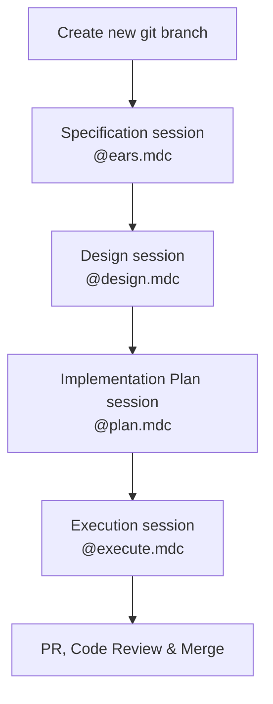

# Spec-driven development for Cursor

A collection of Cursor rules that help you automate your software development process with AI, using spec-driven
development. It's like vibe coding but, because you're putting an effort into planning, with much better results.

These rules are inspired by some of the interesting things people are learning about prompt engineering. Most of the
very clever people online are using [Claude Code](https://https://claude.ai/), which I would love to try out, but I'm
using up my Cursor subscription first before switching. 😊

It's also inspired by [Kiro](https://kiro.dev), AWS' new code assistant. It uses
[EARS (Easy Approach to Requirements Syntax)](https://alistairmavin.com/ears/) as a clear, unambiguous way to describe
requirements.

## Prerequisites

- [Cursor](https://www.cursor.com/)
- [Context7 MCP Server](https://github.com/upstash/context7) - optional but extremely useful
- [Playwright MCP Server](https://github.com/microsoft/playwright-mcp) - optional but also useful

## Installation

Just copy the files from the "rules" directory to your `.cursor/rules`.

## Project Structure

I typically use the following structure in my projects

```txt
my_project/
├─ .cursor/
│  │
│  ├─ rules/
│     ├─ (the rules from this repo)
│
├─ docs/ (all relevant docs, for devs and LLMs)
   │
   ├─ PROJECT.md                  (main project brief)
   ├─ JOURNAL.md                  (the LLM keeps track of what it's done here)
   ├─ (more documents)
   │
   ├─ specs/                      (specs created by the `@ears.mdc` rule)
   │  │
   │  ├─ shopping-cart-spec.md  
   │  
   ├─ design/                     (designs created by the `@design.mdc` rule)
   │  │
   │  ├─ shopping-cart-design.md
   │
   ├─ backlog/                    (implementation plans created with `@plan.mdc` rule)
      │
      ├─ shopping-cart-backlog.md
```

- **.cursor/rules/**:  All the custom Cursor rule files from this repository.
- **docs/**: Contains project-level documentation (idea, architecture, roadmap, etc.).
- **docs/specs/*/**: Contains detailed requirements for each feature
- **docs/design/*/**: Contains detailed technical design for each feature
- **docs/backlog/*/**: Contains detailed implementation plans for each feature

---

## Developer workflow

The development process for new functionality is split into four consecutive collaborative sessions driven by
specialised rule documents. The sessions are:

1. Specification (`@ears.mdc`)
2. Technical design (`@design.mdc`)
3. Implementation plan (`@plan.mdc`)
4. Implementation execution (`@execute.mdc`)

The diagram below shows the flow:



Each session produces an artefact that becomes the input for the next stage. The whole flow is iterative: if new
information surfaces, you can jump back to the earlier session, update the artefact and proceed again.

---

## 1. Start with a new git branch

Create a feature branch off `main`, e.g. `git checkout -b feature/rule-placeholder-text`

This isolates the work and makes it easy to track and review the change-set generated by the subsequent sessions. Most
importantly, it lets you do `git restore .; git reset --hard; git clean -fd` (WARNING: that will delete all your
untracked files unless they're in .gitignore!) if the AI messes up and you want to start over.

---

## 2. Specification session – `@ears.mdc`

Command example: `@ears.mdc a rule that scans for placeholder text`

Use a good thinking model like o3 for best results, and **start a new chat session** so it doesn't get confused with
old context. Starting new chat sessions frequently is **key** to good results.

What happens:

1. The AI reads the `@ears.mdc` rule file (`.cursor/rules/ears.mdc`) and enters *specification mode*.
2. The AI starts an **interactive Q&A loop**.  
   - It asks **one question at a time**, digging into scope, value, edge cases, etc.  
   - You answer until the requirements are fully clarified.
3. When enough detail is gathered, the AI assembles a **Requirements Document**
   - The document uses [EARS syntax](https://alistairmavin.com/ears/) for acceptance criteria
4. The AI asks **where to save** the markdown file (or you tell it where to save it), usually under `docs/specs/`.

This is a very interactive session, where both you and the AI will ask many questions. The AI is pretty good at
understanding what questions to ask, but you should never be shy to provide feedback, ask for clarification, or
tell it to `use context7 and web search for best practice solutions`. This usually gets the AI to search online
for common patterns and implementation guidance.

Really consider what the AI *thinks* your intentions are and make sure they're part of the documentation. If you
miss a detail now, that could turn into a difficult implementation later where the AI just keeps going off-track.

Resulting artefact: `/docs/specs/rule-placeholder-text-spec.md`

---

## 3. Design session – `@design.mdc`

Command example: `@design.mdc @rule-placeholder-text-spec.md`

Use a good thinking model like o3 for best results. Again, start a new chat session before you do this.

What happens:

1. The AI loads the referenced requirements document and the `@design.mdc` rule (`.cursor/rules/design.mdc`).
2. It starts a new **interactive design workshop**. Again, the AI asks one focussed question at a time covering
   architecture, interfaces, data flow, error handling, etc.  
3. Once all questions are answered, the AI compiles a **Design Document**
4. The AI asks **where to save** the markdown file (or you tell it where to save it), usually under `docs/specs/`.

Similar to the previous step, this is a very interactive session.

Resulting artefact: `/docs/specs/rule-placeholder-text-design.md`

---

## 4. Implementation Plan session – `@plan.mdc`

Command example: `@plan.mdc @rule-placeholder-text-spec.md @rule-placeholder-text-design.md`

Since this uses a fair bit of reasoning and planning, a good reasoning model helps, like o3. As usual, start a new
chat session before doing this.

What happens:

1. The AI reads both the requirements and design documents together with the `@plan.mdc` rule.
2. It drafts a **backlog** of user stories that incrementally realise the feature.
3. The AI presents the backlog to you for feedback. You can tell it to change things.
4. After approval the AI expands each story into granular **implementation steps / prompts**
5. The AI asks **where to save** the markdown file (or you tell it where to save it), usually under `docs/specs/`.

The AI will present a high-level plan. Sometimes you realise you need to change a story. This is your chance. If you
realise you need to change or add a story, tell it to update the design document as well.

Sometimes, after switching context like that, it forgets that you are in the middle of a `@plan.mdc` session. If you
notice that it wants to start implementing, stop the session and tell it to resume the process outlined in `@plan.mdc`.

Resulting artefact: `/docs/specs/rule-placeholder-text-plan.md`

---

## 5. Execution session – `@execute.mdc`

Command example:  `@execute.mdc @ule-placeholder-text-plan.md story 1`

Use a good coding model, like Claude 4 Sonnet. **NOTE**: Start a new chat session before **every** story you tackle!
This greatly reduces the chances your AI goes off track and loses track.

Before you start, and **after every story**, really make sure the code is doing what you want. Sometimes the AI sounds
very convincing when it tells you it's done, and then you look at the code and it's a mess. Almost always this is
caused by you not *really* understanding what you wanted to build in the spec or design stages.

When the AI goes off-track and makes a mess, or keeps focusing on unimportant details, or keeps inventing ever more
complicated solutions to failing tests, it's best to reset your workspace to your last commit and try again.

If it still fails, go back to your earlier spec and design stages and see if you can come up with better requirements
for the story.

What happens:

1. The AI reads the implementation plan and selects the story you mentioned.
2. It reads the story and relevant context, and makes a plan to execute it
3. The AI tells you what it wants to do and asks for approval. **NOTE**: It sometimes forgets to ask for approval
   and just forges ahead with implementation, which can be super annoying.
4. Upon approval, the AI implements each step, running linting, type-checking and tests after every change.
   Again, it sometimes forgets to do the linting/testing, sigh.
5. It marks steps, test cases and verification criteria as completed, looping until the story is finished
6. The cycle repeats for the remaining stories until the backlog is exhausted.

Happy building!
