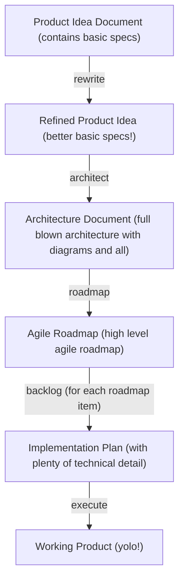
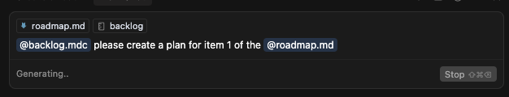

# Cursor Rules for Agile Product Development

This repository contains a set of custom Cursor rules designed to automate and streamline the agile product development
workflow. By following these rules, you can efficiently move from an initial idea to a fully implemented product using a
structured, AI-assisted process.

## PREREQUISITES

- [Cursor](https://www.cursor.com/)
- [Context7 MCP Server](https://github.com/upstash/context7)
- a POSIX called `sh` on your PATH (if you want to run the install script)

## INSTALLATION

This installs the custom rules in your current directory's `.cursor/rules` directory. It won't do anything if that
directory already exists.

```sh
curl -sSL https://raw.githubusercontent.com/gertalot/cursor-rules/main/init.sh | sh
```

### Manual installation

If you can't or don't want to run the script, just copy the files from the "rules" directory to your `.cursor/rules`.

## Project Structure

To get started, run the install script as shown above. This creates the following structure in your current directory:

```txt
my_project
+- .cursor
|    +- rules
|         +- (the rules from this repo)
+- docs
    +- project
    +- backlog
```

- **.cursor/rules/**:  All the custom Cursor rule files from this repository.
- **docs/project/**: Contains project-level documentation (idea, architecture, roadmap, etc.).
- **docs/backlog/**: Contains detailed implementation plans (stories) for each roadmap item.

## Workflow Overview

The following diagram illustrates the overall workflow:



The workflow consists of five main steps, each supported by a specific rule. Here's how to use them. Use each of these
rules in a new chat and reference relevant documents.

### 1. Capture and Refine Your Idea (`rewrite` rule)


- **Create an initial idea document**: In `docs/project/`, write a markdown file describing your product idea. Include
  any relevant references, such as screenshots, UI designs, or other documents. See
  [this starting point](example-starting-point.md) for an example.
- **Use the `rewrite` rule**: Apply the `@rewrite.mdc` rule to your idea document. This rule helps you restructure and
  clarify your idea, making it more actionable and easier to understand. You can iterate with the AI, refining the
  document until you're satisfied.
- **Move to the next step** once your idea is clear and well-structured.

### 2. Design the Architecture (`architect` rule)


- **Apply the `architect` rule**: Use this rule to turn your refined idea into a detailed architectural design document.
  This is an interactive brainstorming session with the AI, where you:
  - Define the tech stack
  - Plan the project structure
  - Design the data model
  - Consider deployment strategies
  - Address other architectural concerns
- **Iterate and refine**: Work with the AI to flesh out all necessary details. When complete, save the result as
  `docs/project/architecture.md`.

### 3. Create an Agile Roadmap (`roadmap` rule)


- **Apply the `roadmap` rule**: Use this rule to generate an agile roadmap from your architecture document. The roadmap
  should:
  - Break down the project into vertical slices
  - Define potentially shippable increments at each step
  - Prioritize features for iterative delivery
- **Collaborate and refine**: Provide feedback to the AI and adjust the roadmap as needed. When finalized, save it as
  `docs/project/roadmap.md`.

### 4. Plan Implementation Stories (`backlog` rule)



- **Select a roadmap item**: Choose one item from your roadmap to implement next.
- **Apply the `backlog` rule**: This rule turns the selected roadmap item into a detailed implementation plan, outlining
  all necessary steps and tasks.
- **Refine the plan**: Work with the AI to ensure the plan is clear and actionable. When ready, save it as
  `docs/backlog/nnn-story-name.md`, where `nnn` is a sequential number for ordering.

### 5. Execute the Plan (`execute` rule)


- **Apply the `execute` rule**: Use this rule to take a backlog story and carry out all commands and code changes
  required to implement the story.
- **Automated execution**: The rule will guide you through the implementation, making code changes, running commands,
  and ensuring the story is completed as planned.
