# Context Engineering Rules for Cursor

A collection of Cursor rules that help you automate your software development process with AI, using [Context
Engineering](https://github.com/coleam00/context-engineering-intro). It's like vibe coding but, because you're putting
an effort into planning, with much better results.

These rules are inspired by some of the interesting things people are learning about prompt engineering. Most of the
very clever people online are using [Claude Code](https://https://claude.ai/), which I would love to try out, but I'm
using up my Cursor subscription first before switching. 😊

## Prerequisites

- [Cursor](https://www.cursor.com/)
- [Context7 MCP Server](https://github.com/upstash/context7) - optional but extremely useful
- [Playwright MCP Server](https://github.com/microsoft/playwright-mcp) - optional but also useful
- a POSIX called `sh` on your PATH (if you want to run the install script)

## Installation

Just copy the files from the "rules" directory to your `.cursor/rules`.

## Project Structure

I typically use the following structure in my projects

```txt
my_project
  +- .cursor
  |    +- rules
  |         +- (the rules from this repo)
  |
  +- docs (all relevant docs, for devs and LLMs)
      +- PROJECT.md     (main project brief)
      +- milestone-1     (a directory per milestone)
      |   +- MILESTONE-1.md     (detailed description of what I want to do in milestone 1)
      |   +- SPEC-1.md     (generated from the @brainstorm.mdc rule with MILESTONE-1.md and PROJECT.md as context)
      |   +- BACKLOG-1.md     (generated from the @plan.mdc rule)
      +- JOURNAL.md     (the LLM keeps track of what it's done here)
      
```

- **.cursor/rules/**:  All the custom Cursor rule files from this repository.
- **docs/**: Contains project-level documentation (idea, architecture, roadmap, etc.).
- **docs/milestone-*/**: Contains detailed documents for each milestone

## Rules

## Language-specific

These are automatically loaded when the agent is working with code files. They define preferred tech stack, versions,
testing, and code style:

- **python-fastapi**
- **typescript-nextjs**

## Context-dependent rules

The following rules are loaded automatically by Cursor depending on what it's doing:

- **backend** - specific information about working with the backend. Included here as an example. I learned the hard
  way that the LLM figured out it could do `echo STUFF > .env` even though Cursor blocks the LLM from editing .env files
  directly. Then it started going on a wild goose chase wondering why it couldn't talk to my database any longer. So
  that's why there's a rule about `.env` files in there.
- **coding-style** - general rules about working with code
- **debugging** - tells the LLM how to approach debugging tasks
- **testing** - promotes a test-driven development approach and encourages the LLM to write tests
- **version-control** - I don't like relying on checkpointing and prefer explicit file management with git so I can
  easily start over when the LLM goes off track. This encourages the LLM to not mess with code without version control.

## Coding workflow rules

The **PRIME_DIRECTIVE** rule is always loaded. It tells the agent where to look for documentation and examples, and
general guidelines around the agent's behaviour. It instructs the LLM to think step by step, use the context7 MCP
server, follow best practice, etc.

It also tells the LLM to always call you **Big Bossman** — if it doesn't, you know it has forgotten some or all of its rules.

| **rule** | **example** | **description** |
| -------- | ----------- | --------------- |
| **brainstorm** | `Read @PROJECT.md and @MILESTONE-1.md for context. @brainstorm.mdc let's brainstorm a spec for milestone 1` | turn an idea into a detailed architecture document |
| **plan** | `Read @SPEC-1.md and all relevant documents for context. @plan.mdc create a backlog for milestone 1` | Produce a number of stories to implement specs |
| **vibecode** | `Read @BACKLOG-1.md . @vibecode.mdc Let's implement story 1` | implement (vibe-code) the story |

## Workflow Overview

The following diagram illustrates the overall workflow:

```mermaid
flowchart TD
    A["Product Brief"] --> B["Milestone Document (optional)"]
    B --> C["Brainstorming Session (@brainstorm.mdc) → Spec Document"]
    C --> D["Planning Session (@plan.mdc) → Backlog Document"]
    D --> E["Vibe Coding (@vibecode.mdc) Implement Stories"]
    E --> F["Testing, Linting, Feedback"]
    F --> G["Ship it!"]
```



The workflow consists of three main steps, each supported by a specific rule. Here's how to use them. Create new chat
sessions often, **at least before starting each of these workflow steps** but sometimes more often.

### 1. Capture and Refine Your Idea

- **Create an initial idea document**: In `docs/PROJECT.md`, write a markdown file describing your product idea.
  Include any relevant references, such as screenshots, UI designs, or other documents.
- **Optionally create a document for a milestone**: to break up your project in smaller chunks, define a milestone of
  what you want to build first. For example, I'm working on a big project involving a backend and frontend, and my first
  milestone is a bare-bones command line tool that proves the core backend functionality.
- **Brainstorm**: Select a good reasoning model such as `o3` and use the `@brainstorm.mdc` rule. Give it your project
  brief and optionally the milestone you want to build. It will take you on a journey with lots of back and forth
  questions to define a specification for your milestone. This can take anywhere from half an hour to a couple of hours.
  Tell it to save the result, e.g. to `docs/milestone-1/SPEC-1.md`. You can make or propose changes to the document.

**Planning REALLY helps** the LLM! the more time you spend on thinking about the details of what you want to build, the
better your vibe coding session will be. You'll spend much more time planning than actually coding.

### 2. Create a backlog

- **Apply the `@plan.mdc` rule**: Use this rule to turn your spec into a detailed backlog. For best results use
  a reasoning model like `o3`. Don't hesitate to give feedback, suggest changes, etc. Save the result as markdown.
- The backlog markdown should have references to relevant documents, which really helps the LLM to understand what is
  important information. That means you don't have to manually load all your markdown docs into the context.

### 5. Vibe code time

- Load your backlog as context (e.g. `@BACKLOG.md`) and tell the LLM that you want to
  `@vibecode.mdc story 1` or something to that effect. It can help to tell the LLM `we're focused on the backend for
  this session`. Use Claude 4 Sonnet for good results.

Make sure you've got your codebase in git before you start and be prepared to stop the session, delete the mess,
`git reset --hard` and start again. Once the LLM is off-track it usually has a hard time fixing its own mess.

The prompts _should_ tell the LLM to take it one step at a time and stop to await further instructions. This gives you a
chance to steer the LLM.

It really helps to set up things like linting, formatting, type checking and tests. In my Python project I've got this
all in a `pre-commit` config, and these prompts will usually trigger the LLM to run
`poetry run pre-commit run --all-files` and iterate until everything is passing. You can usually go grab some coffee
while it's doing this.
